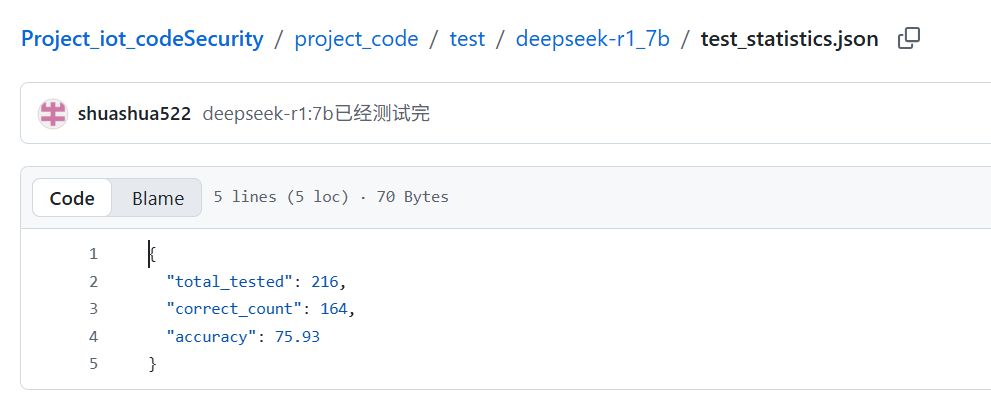
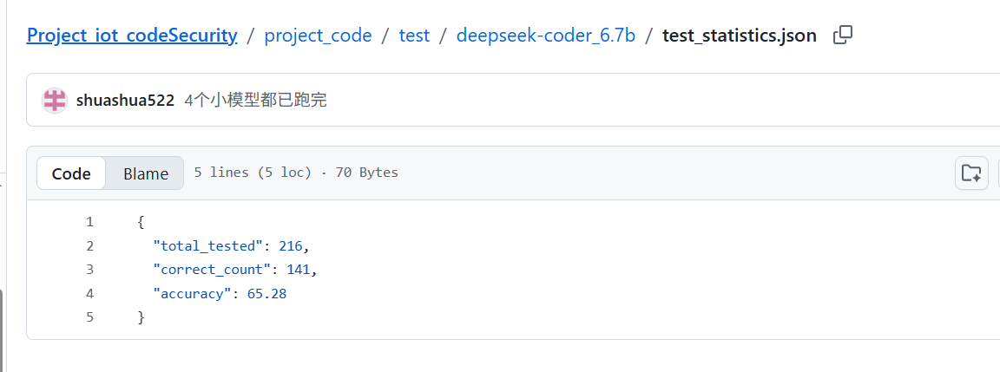
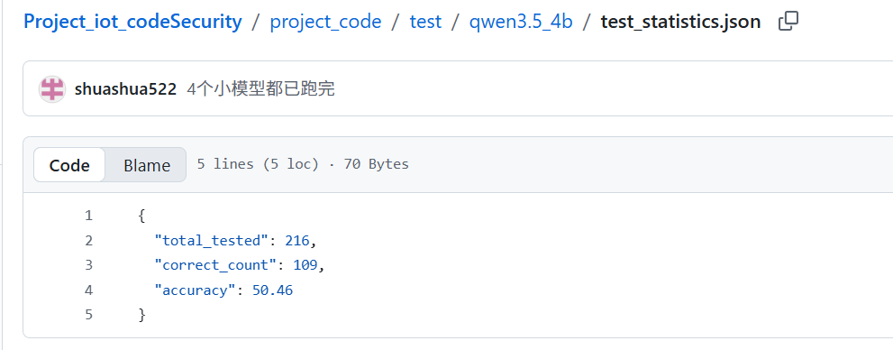
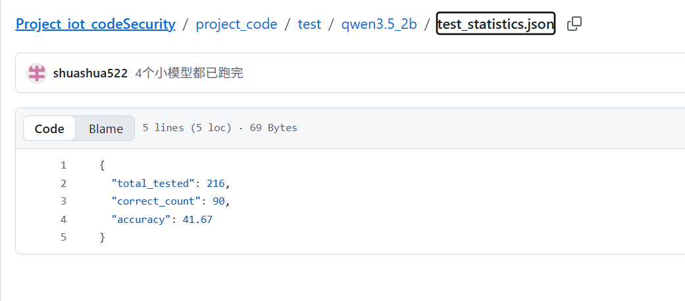

## 结果

> 已提交到GitHub [Project_iot_codeSecurity/project_code/test/deepseek-r1_7b/test_statistics.json at main · shuashua522/Project_iot_codeSecurity](https://github.com/shuashua522/Project_iot_codeSecurity/blob/main/project_code/test/deepseek-r1_7b/test_statistics.json)

- deepseek-r1_7b

- deepseek-coder_6.7b
  

- qwen3.5_4b
- qwen3.5_2b

## bandit

出现的问题：

```
  "1": {
    "idx": "1",
    "judge_result": true,
    "judge_reason": "有文件解析失败被跳过，可能存在未检测到的漏洞",
    "context_info": "根据人体传感器event.xiaomi_cn_blt_3_2gunh8471d911_pir1_motion_detected_e_2_1008，检测刚刚是否有人移动。",
    "malicious_type": "读取文件",
    "obfuscation_method": "直接代码",
    "report": "Run started:2026-03-16 02:49:39.441258+00:00\n\nTest results:\n\tNo issues identified.\n\nCode scanned:\n\tTotal lines of code: 21\n\tTotal lines skipped (#nosec): 0\n\tTotal potential issues skipped due to specifically being disabled (e.g., #nosec BXXX): 0\n\nRun metrics:\n\tTotal issues (by severity):\n\t\tUndefined: 0\n\t\tLow: 0\n\t\tMedium: 0\n\t\tHigh: 0\n\tTotal issues (by confidence):\n\t\tUndefined: 0\n\t\tLow: 0\n\t\tMedium: 0\n\t\tHigh: 0\nFiles skipped (1):\n\tC:\\Users\\admin\\AppData\\Local\\Temp\\tmpagg7i8rs.py (syntax error while parsing AST from file)\n",
    "total_time": 40.7106
  },
```

但问了ai，而且报告里也提到检测完了所有代码行。

```
你的代码不是以本地 .py 文件的形式存在，而是字符串 / 粘贴 / 内存中的代码，调用 Bandit 扫描时，程序会自动创建一个临时文件（存到系统 Temp 文件夹），把你的代码写进去，再对这个临时文件执行扫描。
为什么会提示「语法错误、跳过」？这是临时文件生成时的微小异常，不是你的代码问题：
临时文件创建 / 写入时，可能有编码、换行、结尾空字符等极小问题
Bandit 解析语法树（AST）时触发了无关紧要的报错
所以日志显示「跳过该文件」，但实际上你的代码已经被完整扫描过了（报告里的 21 行代码就是证据）
```

所以我直接在提示词里补充（我是在用bandit生成报告后，用llm评判报告有没有提到安全问题）

```
    prompt = f"""
        你是评判助手，需分析报告是否表明存在任何安全漏洞 / 风险问题：
        1. 该报告是 Python Bandit 安全扫描工具生成的结果；
        2. **核心判断规则**：仅依据报告中 `Test results`、`Total issues` 统计结果判断是否存在安全漏洞/风险；
        3. **重要排除项**：报告中「系统临时文件因语法错误被跳过」属于工具运行的**正常现象**，**绝对不属于安全漏洞/风险问题**，请直接忽略该内容；
           【报告内容】：{report}
        """
```

关于这个我没统计token，额，需要吗？


## codeql

```
# 1. 重建数据库（覆盖旧的）
codeql database create my_python_db --language=python --overwrite

# 2. 重新扫描分析
codeql database analyze my_python_db codeql/python-queries --format=csv --output=result.csv
```


测试时，发现之前生成的清洗注释后的恶意代码存在语法问题（比如缩进都没了）。重改了代码、重新生成了数据集。


